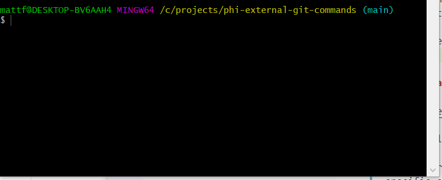
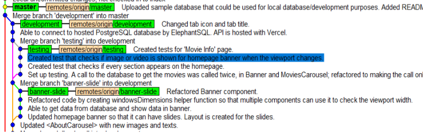
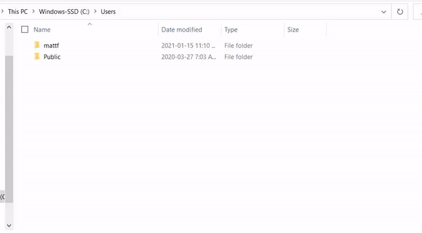

# ::grey_question: What is Git and Gitbash?

Git (the commands) and Gitbash (the GUI that allows us to write our Git commands) essentialy lets us save our code online, much like google drive when we are writing our essays. But, there are `commands` that we muse use to save it online.

## What does Gitbash (The GUI look like)?

## :books: External sources (after you installed Git):

https://learngitbranching.js.org/

Above will teach you the git commands you'll use in your lifetime. You could use Youtube to supplement your learning. However, we will not be using everything in the link above (some of the commands is for very specific cases); hence this guide is created to inform you what git commands you're actually going to be using for this project.

After reading the guide below...
https://www.youtube.com/watch?v=xNVM5UxlFSA&ab_channel=Ihatetomatoes
Will teach you how to handle merge conflicts.

## :x: Git commands to never use (read this after reading the guide below)

## `git merge`

#### I will handle all merges.

## `git reset`

#### Under no circumstances should a git reset be used becuase you are always going to be PUSHING every COMMIT you make

## Project structure

At the end of the day, our git workflow should look something like:

Each "dots" represents a `commit`. They are "save points" for our online code.

`master, development, testing,, banner_slide` are called branches because it looks like a branch.

` testing, banner_slide` are called `feature_branches` because you'll be creating the feature (or testing) in these branches.

After we are done with our `feature_branches`. We want to `merge` it to `development`; `development` acts as a branch that organizes all our `feature branches`.

After we are done with our development branch (when the website is built nd ready to be deployed for production). We will `merge` it to `master`. You don't have to worry about this. I will be doing it.

But what are the `remotes/BRANCH_NAME`? It's just an indicator what branches the remote repository (google the term) has. You don't have to worry / fiddle around with it.

# Below are the steps (in order) to start using git

## 1. Getting the code shared online to our database

## `git clone INSERT_REMOTE_REPOSITORY_LINK`

Allows us to copy the code that we shared online so that we can work on our project locally on our computer.

We can get the link by clicking **Code** as shown above. In our case, we will be using:

Go to a folder you want the save the code online on, open up `Git bash` by right clicking the folder you're at. `Gitbash` will open up (atlest on Windows).

Write the command below on `Gitbash`:

`git clone https://github.com/mattfrancis888/phi-external-git-commands.git`

## 2. Viewing the project workflow

## `gitk`

When you type the command above in Gitbash it shows you the image simmilar to the one in **Project Workflow**.

However...After cloning the project, you are automatically in the main branch. You won't see any changes commits done in `development` or other `feature branches`. So in essence, you'll see nothing. I created a `development` branch with a few commits.

Do `git checkout development` and you'll see new commits appearing.

## 3. Creating a branch (so that you can start creating commits / "save points")

## `git checkout -b NAME`

Where NAME represents whatever name you want for your branch. You'll use this command to create a `feature branch` that you are going to make commits / "save points" on. Do `gitk` again to see your new branch.

## 4. I made a few changes to my code locally, now what?

## `git status`

## `git add .`

`git status` allows you to check files that are **unstaged** (not being tracked by git / git does not see them as files that we should "save") and **staged** files (git cares about the files).

If git does **care** about the file(s), we can create a commit / "save point" based on the files git cares about, which will be demonstrated on my next point.

To do so , we do `git add`.

## 3. Okay I did `git add .`; How do I actually "save" our work / create a "save point"?

## `git commit -m "INSERT MESSAGE"`

## OR

## `git commit`

The commands above will create a "save point" **locally on your computer, but not online**.

Commit messages should be short and simple.

The former command allows you to commit in one line.
The later command allows you to write a commit message in a GUI that's dependant on your OS.

## 4. I have my commit, how do I share my work with others / online?

## `git push BRANCH_NAME origin`

Where BRANCH_NAME is the name of the branch you're commiting on.
Where origin is the name of the online repository I nicknamed. Don't worry why it's called origin.

If our local repository is up to date with our remote repository, we can do this with no problems. But, if someone made a commit on the remote repository and then you tried to do this...you won't be able to.

## 5. What do I do if I cannot do git push because my local repository is not up to date with the remote repository?

## `git add .`

## `git stash`

## `git pull`

## `git stash apply`

`git stash` will stash / save our changes **locally** (without creating a commit) in a hidden file in our computer (at first you might think that your changes dissapeared, but don't worry, it's saved somewhere safe in your computer)

`git pull` updates our local repository with the newest changes in our remote repository

`git stash apply` will apply latest stash that we saved to our current code. Remember the code that dissapeared earlier? Now it's restored :).

This can create a **merge conflict** (the code that we unstashed changes the code / files that we pulled).

Merge conflicts can be understood here:
https://www.youtube.com/watch?v=xNVM5UxlFSA&ab_channel=Ihatetomatoes

You can also **unstash in various ways** (including older stashes) as shown here:
https://stackoverflow.com/questions/10827160/undo-a-git-stash
